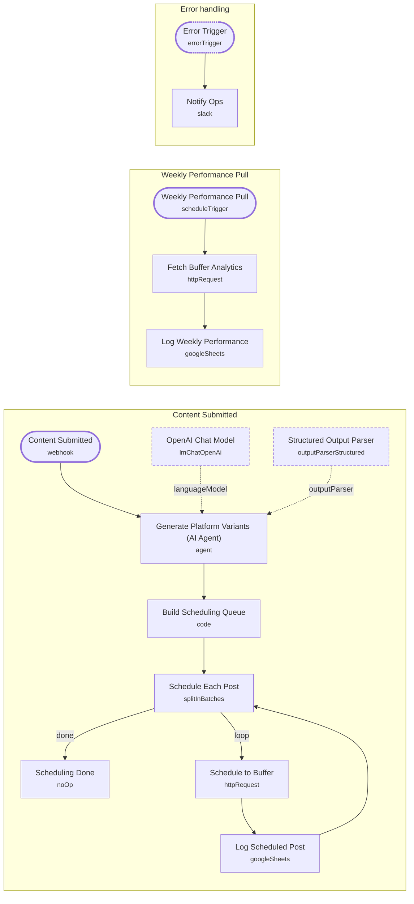

# AI Content Repurposing & Social Publishing System

<!-- CANVAS:START -->

<!-- CANVAS:END -->

Turns one long-form piece of content — a blog post or podcast transcript — into platform-native social posts, then schedules each one through Buffer at staggered times so they don't all go out at once. A second weekly flow pulls Buffer's analytics back into Google Sheets so performance stays visible without logging into Buffer directly.

Built for content and marketing teams who publish long-form content regularly and want social distribution handled automatically instead of manually rewriting and scheduling each variant.

## What it does

**Content submission and scheduling:**

1. **Content Submitted** is a webhook that receives the source content.
2. **Generate Platform Variants (AI Agent)** rewrites the content into three platform-specific versions, using **OpenAI Chat Model** (`gpt-5-mini`, temperature 0.7) and a **Structured Output Parser** that enforces a `{linkedin, xThread, instagram}` JSON schema: a 100-150 word LinkedIn post, a 5-7 tweet X thread as an array, and an Instagram caption with 5 hashtags.
3. **Build Scheduling Queue** (Code node) turns the three variants into three separate items, each tagged with a Buffer profile ID and a staggered send time (LinkedIn +1h, X/Twitter +4h, Instagram +8h from now).
4. **Schedule Each Post** loops through the three items one at a time.
5. **Schedule to Buffer** posts each one to the Buffer API (`updates/create.json`) with the profile ID, text, and scheduled time.
6. **Log Scheduled Post** appends a row to a Google Sheet ("Scheduled Posts" tab) recording platform, content, scheduled time, and status, matched on platform + scheduledAt to avoid duplicate rows.
7. The loop feeds back into **Schedule Each Post** until all three platforms are scheduled, then falls through to **Scheduling Done**.

**Weekly performance pull:**

1. **Weekly Performance Pull** fires every Monday at 9am.
2. **Fetch Buffer Analytics** calls the Buffer profiles analytics endpoint.
3. **Log Weekly Performance** appends the results to a "Weekly Performance" tab in the same Google Sheet, auto-mapping whatever fields Buffer returns.

**Error handling:** a separate **Error Trigger** catches any workflow failure and **Notify Ops** posts it to a Slack ops-alerts channel.

## Sample request

Send a POST to the webhook with the source content:

```json
{
  "content": "Full text of the blog post or podcast transcript to repurpose into LinkedIn, X, and Instagram posts..."
}
```

The webhook responds immediately (`responseMode: onReceived`) and processing continues asynchronously.

## Setup (about 15 minutes)

1. **OpenAI** — add your key in **OpenAI Chat Model**.
2. **Buffer** — add your API token as header auth in **Schedule to Buffer** and **Fetch Buffer Analytics**, and replace the placeholder profile IDs (`REPLACE_WITH_BUFFER_LINKEDIN_PROFILE_ID`, `REPLACE_WITH_BUFFER_TWITTER_PROFILE_ID`, `REPLACE_WITH_BUFFER_INSTAGRAM_PROFILE_ID`) in **Build Scheduling Queue** with your real Buffer profile IDs.
3. **Google Sheets** — connect your account in **Log Scheduled Post** and **Log Weekly Performance**, and set your real spreadsheet ID (replace `REPLACE_WITH_SPREADSHEET_ID`) with "Scheduled Posts" and "Weekly Performance" tabs.
4. **Slack** — connect your account in **Notify Ops** and set your ops-alerts channel ID (replace `REPLACE_WITH_CHANNEL_ID`).

Point your content-submission form or CMS webhook at the production URL of **Content Submitted**.

## Error handling

Buffer API calls retry up to three times before failing, and Drive-adjacent Sheets writes continue even if intermediate steps error where configured. A dedicated **Error Trigger** posts the failing node's error message to a Slack alerts channel so a broken scheduling run or analytics pull is caught the same day.

---

<!-- ARCHITECTURE:START -->
## Architecture



> Shapes: rounded = trigger, hexagon = branch point. Dashed borders mark AI sub-nodes; dotted edges are the model, memory and tool connections feeding an agent. Faded nodes are disabled in this export.
<!-- ARCHITECTURE:END -->
