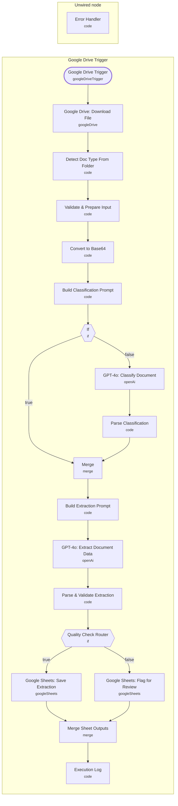

# AI Document & Invoice Extraction from Google Drive

<!-- CANVAS:START -->

<!-- CANVAS:END -->

Watches a Google Drive folder for newly uploaded invoices, converts each file to a format GPT-4o can read, classifies the document type, extracts structured line-item data with a schema tailored to invoices, receipts, or purchase orders, and writes the result into Google Sheets — routing low-confidence extractions to a separate review tab instead of mixing them in with clean data.

Built for finance and back-office teams who receive vendor documents by upload and want structured, sheet-ready data without manual re-keying, while still catching extractions that need a human to double-check.

## What it does

1. **Google Drive Trigger** polls a specific Drive folder every minute for newly created files.
2. **Google Drive: Download File** downloads the new file as binary, auto-converting Google Docs to PDF if needed.
3. **Detect Doc Type From Folder** (Code node) hardcodes the document type as `invoice` for this copy of the workflow (the code comments explain that duplicating this workflow for receipts or purchase orders means changing this one constant).
4. **Validate & Prepare Input** checks that binary data exists, that the MIME type is one of PDF/PNG/JPEG/TIFF/WEBP, and that the file is under 20MB, throwing a clear error otherwise. It also generates a unique `submission_id` and carries the document-type override forward.
5. **Convert to Base64** reshapes the binary into a base64 string, since the OpenAI API needs image/document data embedded in the JSON request body rather than as a raw file.
6. **Build Classification Prompt** checks whether the document type is already known from the folder (skipping classification) or builds a GPT-4o classification prompt asking it to identify the document as an invoice, receipt, or purchase order.
7. **If** branches on whether classification was skipped:
   - Skipped: goes straight to **Merge**.
   - Not skipped: **GPT-4o: Classify Document** calls OpenAI, and **Parse Classification** parses the JSON response (falling back to `invoice`/low-confidence if parsing fails), then flows into **Merge**.
8. **Merge** combines the classification result back with the original item.
9. **Build Extraction Prompt** selects one of three detailed JSON extraction schemas (invoice, receipt, or purchase order) based on the detected document type, each schema covering vendor/buyer details, line items, totals, and dates.
10. **GPT-4o: Extract Document Data** calls OpenAI to extract structured data from the document image/PDF.
11. **Parse & Validate Extraction** parses the JSON response, runs type-specific completeness checks (e.g. missing invoice number, missing total, missing vendor name), and flattens everything into a single `sheets_record` with an `extraction_quality` of COMPLETE, PARTIAL, or POOR.
12. **Quality Check Router** (IF node) branches on whether quality is POOR:
    - POOR: **Google Sheets: Flag for Review** appends the record to a "Needs Review" tab.
    - COMPLETE/PARTIAL: **Google Sheets: Save Extraction** appends the record to the main "Extractions" tab.
13. **Merge Sheet Outputs** combines both possible paths back into one stream.
14. **Execution Log** (Code node) logs a structured JSON summary of the run (vendor, document number, date, total, line item count) to the execution output.

A separate, disconnected **Error Handler** node exists in the workflow but has no incoming connection — see the note below.

## Setup (about 20 minutes)

1. **Google Drive** — connect your OAuth2 account in **Google Drive Trigger** and **Google Drive: Download File**, and point the trigger at your own invoices folder (replace the folder ID currently set to a specific "Invoices" folder).
2. **OpenAI (GPT-4o)** — the two OpenAI nodes, **GPT-4o: Classify Document** and **GPT-4o: Extract Document Data**, are unconfigured placeholders. Set the model to `gpt-4o`, add a messages array with the relevant prompt plus the base64 image as image input, set the temperature/max-token/JSON-format options noted on each node, and attach your OpenAI credentials.
3. **Google Sheets** — connect your account and replace `YOUR_GOOGLE_SHEETS_DOCUMENT_ID` in both **Google Sheets: Save Extraction** and **Google Sheets: Flag for Review** with your real spreadsheet ID. Create "Extractions" and "Needs Review" tabs matching the fields written in **Parse & Validate Extraction**.
4. **Duplicate per document type** — this workflow copy is hardcoded to `invoice` in **Detect Doc Type From Folder**. To handle receipts or purchase orders from a different folder, duplicate the workflow, change that one constant, and point the Drive trigger at the corresponding folder.

## Error handling

**Validate & Prepare Input** throws explicit errors for missing binary data, unsupported file types, and oversized files rather than failing silently, and low-confidence extractions are automatically routed to a "Needs Review" sheet instead of the main data tab. However, the workflow's **Error Handler** node (which builds a structured error log) is not wired into any node's error output or connected to any trigger — it currently has no incoming connections in `connections`, so it does not run automatically on failure. Wire it to the relevant nodes' error output, or add a workflow-level Error Trigger, before relying on it in production.

---

<!-- ARCHITECTURE:START -->
## Architecture

> Shapes: rounded = trigger, hexagon = branch point. Dashed borders mark AI sub-nodes; dotted edges are the model, memory and tool connections feeding an agent. Faded nodes are disabled in this export.
<!-- ARCHITECTURE:END -->
