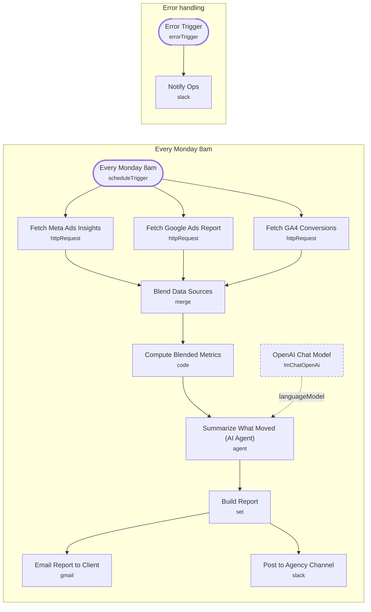

# Automated Client Ad Reporting

<!-- CANVAS:START -->

<!-- CANVAS:END -->

Every Monday morning, this workflow pulls the last 7 days of spend and performance from Meta Ads and Google Ads, blends in GA4 conversions and revenue, and generates a branded performance report with an AI-written summary of what moved and why. The report lands in the client's inbox and in the agency's Slack channel automatically.

Built for marketing agencies and in-house paid media teams who need consistent, on-time client reporting without a Monday morning scramble to pull numbers from three different dashboards.

## What it does

1. **Every Monday 8am** triggers the workflow on a weekly schedule.
2. Three requests fan out in parallel:
   - **Fetch Meta Ads Insights** pulls spend, impressions, clicks, and actions from the Meta Graph API for the last 7 days.
   - **Fetch Google Ads Report** runs a GAQL query against the Google Ads API for campaign cost, clicks, and conversions.
   - **Fetch GA4 Conversions** requests a GA4 Data API report for conversions and revenue by channel over the last 7 days.
3. **Blend Data Sources** merges all three responses into a single item.
4. **Compute Blended Metrics** (Code node) sums Meta and Google spend into a total, totals GA4 conversions and revenue, and computes ROAS.
5. **Summarize What Moved (AI Agent)**, backed by **OpenAI Chat Model** (GPT-5 mini), writes a 3-4 sentence plain-language summary highlighting the standout metric, a risk, and a recommendation.
6. **Build Report** assembles an HTML report combining the computed metrics with the AI summary.
7. The report fans out to two destinations:
   - **Email Report to Client** sends the HTML report via Gmail.
   - **Post to Agency Channel** posts a spend/ROAS summary to Slack.

## Setup (about 20 minutes)

1. **Meta Ads API**: add a header-auth credential in *Fetch Meta Ads Insights* and replace `act_YOUR_AD_ACCOUNT` in the URL with your ad account id.
2. **Google Ads API**: add a header-auth credential in *Fetch Google Ads Report* and replace `YOUR_CUSTOMER_ID` in the URL with your Google Ads customer id.
3. **GA4 API**: add a header-auth credential in *Fetch GA4 Conversions* and replace `YOUR_GA4_PROPERTY_ID` in the URL with your GA4 property id.
4. **OpenAI**: add your API key in *OpenAI Chat Model*.
5. **Gmail**: connect your account in *Email Report to Client* and replace `client@REPLACE_WITH_CLIENT_DOMAIN.com` with the real client recipient.
6. **Slack**: connect Slack OAuth2 in *Post to Agency Channel* and *Notify Ops*, and replace the placeholder channel ids with your agency's `client-reports` and `ops-alerts` channels.
7. All HTTP Request and Slack/Gmail credential ids in this template are placeholders (`REPLACE_WITH_CREDENTIAL_ID`) — set real credentials for every node before activating.

## Error handling

The three data-fetch HTTP nodes retry up to 3 times on failure, and the Gmail send retries up to 2 times. A dedicated **Error Trigger** catches any workflow failure and **Notify Ops** posts the failing error message to an ops Slack channel so a missed report gets caught the same day.

---

<!-- ARCHITECTURE:START -->
## Architecture

> Shapes: rounded = trigger, hexagon = branch point. Dashed borders mark AI sub-nodes; dotted edges are the model, memory and tool connections feeding an agent. Faded nodes are disabled in this export.
<!-- ARCHITECTURE:END -->
