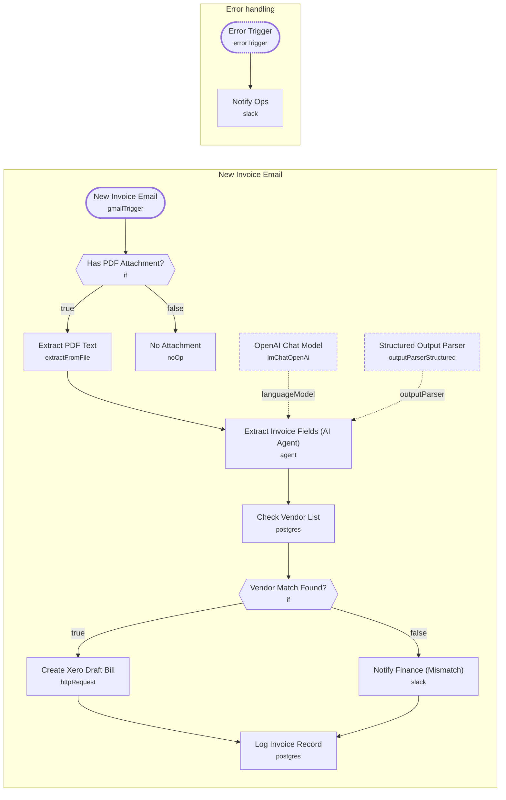

# Automated Invoice & Document Processing Pipeline

<!-- CANVAS:START -->

<!-- CANVAS:END -->

Watches a Gmail inbox for incoming invoice emails, extracts the PDF text, and uses an LLM to pull out structured fields (vendor, amount, due date, line items). Each invoice is checked against a known vendor list in Postgres: recognized vendors are pushed into Xero automatically as draft bills, while unrecognized ones are routed to finance for manual review. Every invoice is logged to Postgres either way.

Built for finance and accounts-payable teams who want invoices captured and entered into their accounting system automatically, with a safety net for anything that doesn't match a known vendor.

## What it does

1. **New Invoice Email** polls Gmail every minute for unread messages matching `label:invoices has:attachment newer_than:1d`, downloading attachments.
2. **Has PDF Attachment?** checks whether the email actually has an attachment.
   - If not, **No Attachment** is a no-op that ends the run.
   - If yes, continues to **Extract PDF Text**.
3. **Extract PDF Text** pulls the text content out of the PDF attachment.
4. **Extract Invoice Fields (AI Agent)**, backed by **OpenAI Chat Model** (GPT-5 mini, temperature 0) and **Structured Output Parser**, extracts vendor, amount, currency, due date, invoice number, and line items into a fixed JSON schema.
5. **Check Vendor List** queries Postgres for a vendor row matching the extracted vendor name (case-insensitive).
6. **Vendor Match Found?** branches on whether any rows were returned.
   - If matched, **Create Xero Draft Bill** posts a new `ACCPAY` invoice to Xero in `DRAFT` status with the extracted contact, due date, and line items.
   - If not matched, **Notify Finance (Mismatch)** posts an alert to Slack flagging the invoice for manual review.
7. Both branches converge on **Log Invoice Record**, which inserts the vendor, amount, currency, due date, invoice number, and a matched flag into a Postgres `invoice_log` table.

## Setup (about 20 minutes)

1. **Gmail**: connect your account in *New Invoice Email* and make sure an `invoices` label exists (or adjust the filter query) so the trigger only picks up relevant mail.
2. **OpenAI**: add your API key in *OpenAI Chat Model*.
3. **Postgres**: connect your account in *Check Vendor List* and *Log Invoice Record*, and make sure the `vendors` and `invoice_log` tables exist in your database with the columns referenced in those queries.
4. **Xero**: add a header-auth credential in *Create Xero Draft Bill* pointing at your Xero API access token.
5. **Slack**: connect Slack OAuth2 in *Notify Finance (Mismatch)* and *Notify Ops*, and set the channel ids (`REPLACE_WITH_CHANNEL_ID`, labeled `finance-review` and `ops-alerts`) to your real channels.
6. All credential ids in this template are placeholders — replace every `REPLACE_WITH_CREDENTIAL_ID` before activating.

## Error handling

*Check Vendor List* retries up to 2 times and *Create Xero Draft Bill* retries up to 3 times on failure. A dedicated **Error Trigger** catches any workflow failure and **Notify Ops** posts the failing error message to an ops Slack channel.

---

<!-- ARCHITECTURE:START -->
## Architecture

> Shapes: rounded = trigger, hexagon = branch point. Dashed borders mark AI sub-nodes; dotted edges are the model, memory and tool connections feeding an agent. Faded nodes are disabled in this export.
<!-- ARCHITECTURE:END -->
