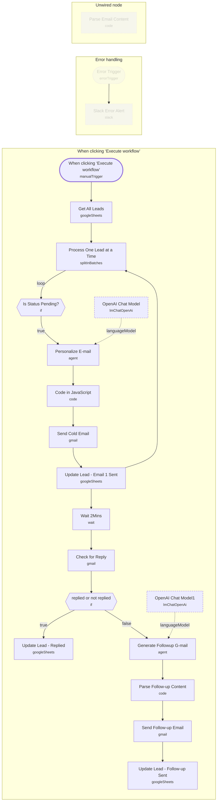

# Cold Email Outreach Automation

<!-- CANVAS:START -->

<!-- CANVAS:END -->

A full cold-outreach sequencer that reads leads from Google Sheets, writes a personalized first-touch email with an LLM, sends it via Gmail, waits, checks the same thread for a reply, and — if there's no reply — generates and sends a follow-up email automatically. Every step updates lead status back in the source spreadsheet.

Built for a small sales or agency team running one-person cold email campaigns who want personalized, on-brand outreach without manually tracking replies in a CRM.

## What it does

1. **When clicking 'Execute workflow'** kicks off the run.
2. **Get All Leads** (Google Sheets) reads every row from the leads spreadsheet.
3. **Process One Lead at a Time** (Split In Batches) processes leads one by one.
4. **Is Status Pending?** (IF) checks whether the lead's `Status` column equals `"Pending"`; only pending leads continue.
5. **Personalize E-mail** (LangChain Agent, backed by **OpenAI Chat Model** on GPT-5-mini) writes a personalized cold email as structured JSON (subject, greeting, opening line, pain point, value proposition, CTA, fixed sign-off) based on the lead's name, company, role and industry.
6. **Code in JavaScript** parses the agent's JSON output (with regex fallback if parsing fails) and renders both a plain-text and a styled HTML version of the email.
7. **Send Cold Email** (Gmail) sends the HTML email to the lead's address.
8. **Update Lead - Email 1 Sent** (Google Sheets) writes back the thread ID, status ("Email 1 Sent") and send date, matched on the lead's email address.
9. From there the workflow branches into a loop-continuation path (back to **Process One Lead at a Time**) and a reply-check path:
10. **Wait 2Mins** pauses before checking for a reply (a placeholder interval — in production this would typically be hours or days).
11. **Check for Reply** (Gmail) searches the inbox for a reply on the same `Thread_ID`.
12. **replied or not replied** (IF) branches on whether any reply items were returned.
    - If a reply exists: **Update Lead - Replied** (Google Sheets) marks the lead `Status = "Replied"`, records the reply date and schedules a follow-up date.
    - If no reply: **Generate Followup G-mail** (LangChain Agent, backed by **OpenAI Chat Model1**) writes a fresh-angle follow-up email (never references the first email directly) as structured JSON.
13. **Parse Follow-up Content** (Code) parses that JSON and builds the plain-text and HTML follow-up email.
14. **Send Follow-up Email** (Gmail) sends the follow-up to the lead.
15. **Update Lead - Follow-up Sent** (Google Sheets) marks the lead `Status = "Follow Up Sent"` with the send date.

A disabled legacy branch (**Parse Email Content**, feeding nothing) and a disabled **Error Trigger** → **Slack Error Alert** pair are also present in the canvas but not active in the current flow (see Error handling below).

## Setup (about 15 minutes)

1. **Google Sheets** — connect Google Sheets OAuth2 in **Get All Leads**, **Update Lead - Email 1 Sent**, **Update Lead - Replied** and **Update Lead - Follow-up Sent**. Replace the hardcoded spreadsheet ID (`1zcu-3_I_PDgwjmAv-OEoKM2l-FGizrJ-U1IMIs6Lp-I`) with your own leads sheet, keeping the columns: `E-mail`, `First_Name`, `Last_Name`, `Company`, `Job_Title`, `Industry`, `Status`, `Email_Sent_Date`, `Thread_ID`, `Reply_Date`, `Followup_Date`.
2. **Gmail** — connect Gmail OAuth2 in **Send Cold Email**, **Check for Reply** and **Send Follow-up Email**. Update the hardcoded `replyTo` address (`you@example.com`) in **Send Cold Email** to your real sending address.
3. **OpenAI** — add your API key in **OpenAI Chat Model** and **OpenAI Chat Model1** (both GPT-5-mini).
4. **Sender details** — the email copy is generated with a placeholder sign-off ("Your Name / Your Company / Your City") baked directly into both the AI agent prompts and the Code nodes' HTML templates (**Code in JavaScript**, **Parse Follow-up Content**). Replace these with your own sender name, company and contact details before using this in production.
5. **Wait interval** — the **Wait 2Mins** node uses a 2-minute delay for demo purposes; increase this to a realistic follow-up window (e.g. 2–3 days) for real campaigns.

## Error handling

An **Error Trigger** → **Slack Error Alert** pair exists on the canvas to post workflow failures to Slack, but both nodes are disabled, so no error notifications currently fire. Enable them and configure the Slack OAuth2 credential to get live alerts on failures. There is also a disabled, unused **Parse Email Content** node left over from an earlier version of the email-parsing logic — safe to remove during cleanup.

---

<!-- ARCHITECTURE:START -->
## Architecture

> Shapes: rounded = trigger, hexagon = branch point. Dashed borders mark AI sub-nodes; dotted edges are the model, memory and tool connections feeding an agent. Faded nodes are disabled in this export.
<!-- ARCHITECTURE:END -->
