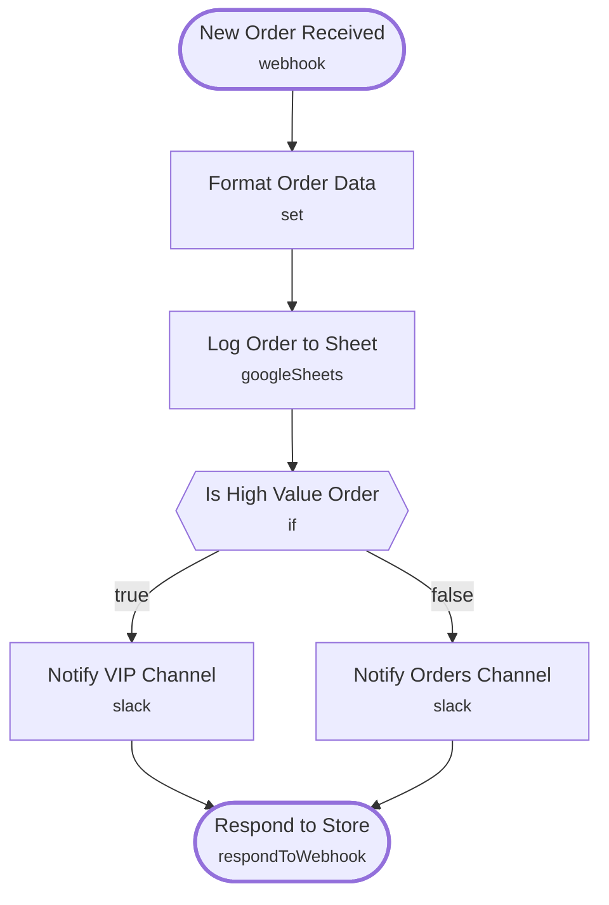

# Ecommerce Order Notifier and Logger

<!-- CANVAS:START -->

<!-- CANVAS:END -->

Receives every new store order through a webhook, logs it to a Google Sheet for reporting, and alerts the right Slack channel depending on order value.

Built for small online store owners and ecommerce operations teams who want every order tracked and high-value orders flagged for priority attention, without checking the storefront dashboard manually.

## What it does

1. **New Order Received** is a webhook that accepts the order payload from your store's order-created event.
2. **Format Order Data** maps the raw webhook body into clean fields: `order_id`, `customer`, `email`, `total`, and `items`.
3. **Log Order to Sheet** appends the order as a new row in a Google Sheet for record-keeping.
4. **Is High Value Order** checks whether the order total is greater than 200.
   - If true, **Notify VIP Channel** posts a priority alert to Slack with the customer, total, and order id.
   - If false, **Notify Orders Channel** posts a standard new-order message to Slack.
5. **Respond to Store** returns a JSON confirmation (`status: received`, plus the order id) back to the calling store.

## Sample request

Send a POST to the webhook with a body like this:

```json
{
  "order_id": "ORD-10432",
  "customer_name": "Jane Doe",
  "email": "jane@example.com",
  "total": 249.99,
  "items": "1x Wool Coat, 1x Scarf"
}
```

## Setup (about 10 minutes)

1. **Webhook**: point your store's order-created event to the *New Order Received* URL (path `new-order`, method POST).
2. **Google Sheets**: connect your account in *Log Order to Sheet* and replace the placeholder spreadsheet id with your own "Orders" sheet, using an `Order ID` column.
3. **Slack**: connect Slack OAuth2 in *Notify VIP Channel* (channel "vip-orders") and *Notify Orders Channel* (channel "new-orders"), and update both channel ids to your actual workspace channels.
4. Adjust the 200 threshold in *Is High Value Order* to match your average order value.

---

<!-- ARCHITECTURE:START -->
## Architecture



> Shapes: rounded = trigger, hexagon = branch point. Dashed borders mark AI sub-nodes; dotted edges are the model, memory and tool connections feeding an agent. Faded nodes are disabled in this export.
<!-- ARCHITECTURE:END -->
