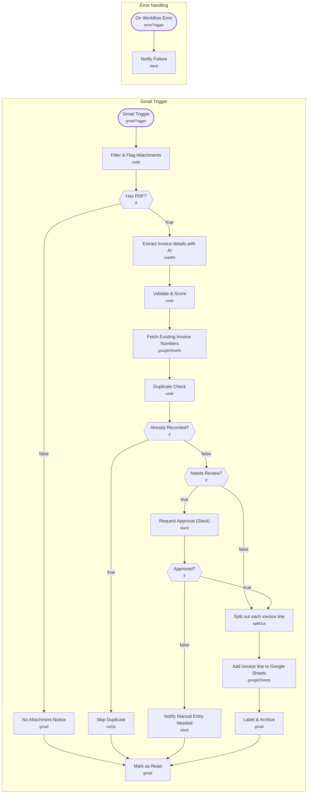

# Invoice Extraction with Human-in-the-Loop (Cradl AI)

<!-- CANVAS:START -->

<!-- CANVAS:END -->

A polling workflow that watches a Gmail inbox for invoice PDFs, extracts structured line-item data with Cradl AI, scores every extraction for completeness, blocks duplicates against the sheet already on record, and routes anything questionable to an approval prompt in Slack before a single row is written.

Built for finance/accounting teams who receive invoices by email and want line-item-level data in a spreadsheet — without manually retyping every PDF, and without a bad extraction silently landing in the ledger.

The human-in-the-loop step is a real gate in n8n: Slack's **sendAndWait** pauses the execution until a person clicks Approve or Send to Manual Entry. Only clean or approved invoices reach Google Sheets.

## What it does

1. **Gmail Trigger** polls every minute for unread messages matching `has:attachment subject:invoice`, downloading attachments.
2. **Filter & Flag Attachments** (code) inspects each message's binaries and sets a `hasPdf` flag, carrying `messageId`, `threadId`, `subject` and `from` forward.
3. **Has PDF?** branches on that flag.
   - **false** — **No Attachment Notice** replies to the message saying no PDF was found, then falls through to **Mark as Read** so the every-minute poll stops re-fetching it.
   - **true** — extraction proceeds.
4. **Extract invoice details with AI** sends the PDF binary to a Cradl AI agent (`agentId: cradl:agent:556e…cd43`). Retries on failure.
5. **Validate & Score** (code) checks the extracted invoice for completeness and internal consistency — invoice number, vendor, currency, total, and whether the line amounts sum to the stated total — and emits `needsReview` plus a list of `issues`.
6. **Fetch Existing Invoice Numbers** reads the target sheet, and **Duplicate Check** (code) cross-references every invoice extracted this run against every `invoice_number` already recorded. It deliberately runs once per execution rather than per item, because the two branches carry different item counts and 1:1 pairing would break.
7. **Already Recorded?** branches on `isDuplicate`.
   - **true** — **Skip Duplicate** ends that invoice's path and marks the mail read. Nothing is written.
   - **false** — continue to review.
8. **Needs Review?** branches on the score from step 5.
   - **false** (clean) — straight to **Split out each invoice line**.
   - **true** — **Request Approval (Slack)** posts vendor, invoice number, total and the detected issues to the AP channel and *waits* for a decision.
9. **Approved?** branches on the reviewer's answer.
   - **Approve** — the invoice continues to **Split out each invoice line**.
   - **Send to Manual Entry** — **Notify Manual Entry Needed** posts to Slack and the run ends at **Mark as Read**. Nothing is written.
10. **Split out each invoice line** expands `body.output.invoice_lines` into one item per line, keeping the other extracted fields alongside each.
11. **Add invoice line to Google Sheets** appends each line as a row, then **Label & Archive** applies your label and **Mark as Read** closes out the message.

## Sample input

There is no webhook — the trigger is Gmail polling, so the "input" is an email with a PDF attachment and "invoice" in the subject:

```
From: vendor@supplier.com
To: invoices@mycompany.com
Subject: Invoice #4471 - March services
Attachment: invoice_4471.pdf
```

The Cradl AI output that feeds validation and the sheet looks roughly like:

```json
{
  "body": {
    "output": {
      "invoice_number": "4471",
      "vendor_name": "Acme Supplier Co.",
      "currency": "USD",
      "invoice_total": 3000.00,
      "invoice_date": "2026-03-01",
      "invoice_lines": [
        { "description": "Consulting - March", "quantity": 1, "unit_price": 2500.00, "amount": 2500.00 },
        { "description": "Support retainer", "quantity": 1, "unit_price": 500.00, "amount": 500.00 }
      ]
    }
  }
}
```

> The field paths in **Validate & Score** and **Duplicate Check** assume this shape. Verify it against a real execution of your own agent and adjust the paths if your schema differs — both code nodes flag this in their comments.

## Setup (about 30 minutes)

1. **Cradl AI** — [create an account](https://rc.app.cradl.ai/login?redirect=signup&template=n8n%2Finvoices-gmail-to-sheets.json), define an invoice extraction agent, then add the credential to **Extract invoice details with AI** and replace the hardcoded `agentId` with your own.
2. **Gmail** — connect an OAuth credential to **Gmail Trigger**, **No Attachment Notice**, **Label & Archive** and **Mark as Read**. Adjust the search filter (`has:attachment subject:invoice`) to match your inbox conventions.
3. **Label & Archive** ships with an empty `labelIds` — pick the label you want applied, or the node will no-op.
4. **Google Sheets** — connect credentials and select the spreadsheet and tab on **both** **Fetch Existing Invoice Numbers** and **Add invoice line to Google Sheets**. They ship as `SELECT YOUR INVOICE SHEET` / `SELECT YOUR TAB` placeholders and must point at the same sheet for duplicate detection to work.
5. **Duplicate Check** assumes the sheet has a column literally named `invoice_number`. Update the key in the code node if your header differs.
6. **Slack** — connect an account and choose your AP channel on **Request Approval (Slack)** and **Notify Manual Entry Needed**, plus an alerts channel on **Notify Failure**.
7. Since the trigger polls every minute, watch Gmail API quota on a high-volume mailbox.

## Error handling

**Extract invoice details with AI** retries on failure. A separate **On Workflow Error** error trigger catches any unhandled failure in the run and posts the error message to Slack via **Notify Failure**.

Two things worth knowing before running this unattended:

- **Approval steps hold the execution open.** `sendAndWait` on **Request Approval (Slack)** pauses that execution until someone responds. Invoices awaiting review sit as running executions, so set a reasonable execution timeout for your volume.
- **Notify Failure also uses `sendAndWait`** with a free-text response, so a failure alert waits on a human reply too. If you would rather fire-and-forget error alerts, switch that node's operation to a plain `send`.

---

<!-- ARCHITECTURE:START -->
## Architecture


```mermaid
flowchart LR
    subgraph G0 ["Gmail Trigger"]
        N0(["Gmail Trigger<br/><small>gmailTrigger</small>"])
        N1["Filter &amp; Flag Attachments<br/><small>code</small>"]
        N2{{"Has PDF?<br/><small>if</small>"}}
        N3["No Attachment Notice<br/><small>gmail</small>"]
        N4["Extract invoice details with AI<br/><small>cradlAi</small>"]
        N5["Validate &amp; Score<br/><small>code</small>"]
        N6["Fetch Existing Invoice Numbers<br/><small>googleSheets</small>"]
        N7["Duplicate Check<br/><small>code</small>"]
        N8{{"Already Recorded?<br/><small>if</small>"}}
        N9["Skip Duplicate<br/><small>noOp</small>"]
        N10{{"Needs Review?<br/><small>if</small>"}}
        N11["Request Approval (Slack)<br/><small>slack</small>"]
        N12{{"Approved?<br/><small>if</small>"}}
        N13["Notify Manual Entry Needed<br/><small>slack</small>"]
        N14["Split out each invoice line<br/><small>splitOut</small>"]
        N15["Add invoice line to Google Sheets<br/><small>googleSheets</small>"]
        N16["Label &amp; Archive<br/><small>gmail</small>"]
        N17["Mark as Read<br/><small>gmail</small>"]
    end
    subgraph G1 ["Error handling"]
        N18(["On Workflow Error<br/><small>errorTrigger</small>"])
        N19["Notify Failure<br/><small>slack</small>"]
    end
    N0 --> N1
    N1 --> N2
    N2 -->|true| N4
    N2 -->|false| N3
    N3 --> N17
    N4 --> N5
    N5 --> N6
    N6 --> N7
    N7 --> N8
    N8 -->|true| N9
    N8 -->|false| N10
    N9 --> N17
    N10 -->|true| N11
    N10 -->|false| N14
    N11 --> N12
    N12 -->|true| N14
    N12 -->|false| N13
    N13 --> N17
    N14 --> N15
    N15 --> N16
    N16 --> N17
    N18 --> N19

    class N0 trigger
    class N18 errorPath
    classDef trigger stroke-width:3px
    classDef aiSubnode stroke-dasharray:5 3
    classDef errorPath stroke-width:3px,stroke-dasharray:2 2
    classDef disabled stroke-dasharray:1 4,opacity:0.45
```

> Shapes: rounded = trigger, hexagon = branch point. Dashed borders mark AI sub-nodes; dotted edges are the model, memory and tool connections feeding an agent. Faded nodes are disabled in this export.
<!-- ARCHITECTURE:END -->
