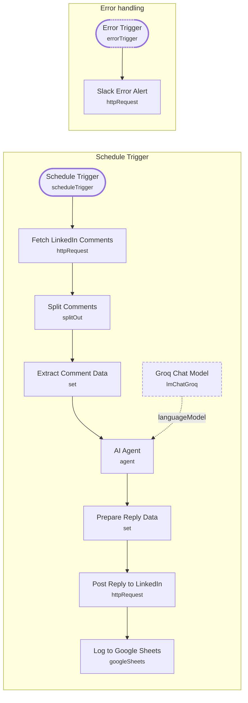

# LinkedIn Comment Responder

<!-- CANVAS:START -->

<!-- CANVAS:END -->

A scheduled workflow that polls a specific LinkedIn post for new comments, drafts an AI reply to each one, posts the reply back to LinkedIn, and logs every exchange to Google Sheets.

Built for creators and thought leaders who post regularly on LinkedIn and want to keep engagement high by replying to every comment without manually checking the post throughout the day.

## What it does

1. **Schedule Trigger** runs every 15 minutes.
2. **Fetch LinkedIn Comments** (HTTP Request against the LinkedIn `socialActions` API) retrieves up to 50 comments on the configured post URN.
3. **Split Comments** splits the `elements` array into one item per comment.
4. **Extract Comment Data** (Set) pulls out `commentId`, `commentText`, `authorName`, `postUrl` and a `timestamp` for each comment.
5. **AI Agent** (LangChain Agent, backed by **Groq Chat Model**) generates a reply to the comment.
6. **Prepare Reply Data** (Set) reassembles the AI's reply alongside the original comment metadata (`commentId`, `commentText`, `authorName`, `postUrl`, `timestamp`).
7. **Post Reply to LinkedIn** (HTTP Request) posts the generated reply back to the comment thread via the LinkedIn API.
8. **Log to Google Sheets** appends the comment, author and reply to a tracking spreadsheet.

A separate **Error Trigger** → **Slack Error Alert** pair is wired in parallel to catch workflow-level failures.

## Setup (about 15 minutes)

1. **LinkedIn** — connect LinkedIn OAuth2 in **Fetch LinkedIn Comments** and **Post Reply to LinkedIn**.
2. **Post URN** — set the `LINKEDIN_POST_URN` workflow variable to the post you want to monitor; it's referenced via `$vars.LINKEDIN_POST_URN` in both the fetch and reply HTTP nodes.
3. **Groq** — add your Groq API key in **Groq Chat Model**.
4. **Google Sheets** — connect Google Sheets OAuth2 in **Log to Google Sheets** and point it at your own tracking sheet (currently set to spreadsheet ID `1Ocv_xyy3B9WpcpyJWo8MnngKB1HBA_WvUx_h5W_iXoI`).
5. **Slack** — the **Slack Error Alert** node currently posts to a literal placeholder URL (`YOUR_SLACK_WEBHOOK_URL`); replace this with a real Slack incoming-webhook URL before relying on it.

## Known issues to fix before use

- The **AI Agent** node's prompt is currently set to the placeholder text `"hellp"` instead of real reply-drafting instructions, and it doesn't reference `{{ $json.commentText }}` as input — this needs a proper system/user prompt (persona, tone, length limits, the actual comment text) before the workflow will produce usable replies.
- **Post Reply to LinkedIn**'s body parameters are empty (`bodyParameters.parameters: [{}]`), so the actual reply text/body needs to be mapped in before this call will work.

## Error handling

An **Error Trigger** captures any workflow failure and forwards it to **Slack Error Alert** via HTTP POST — but that node's webhook URL is a placeholder (see Setup above), so alerts will not be delivered until it's configured with a real endpoint.

---

<!-- ARCHITECTURE:START -->
## Architecture

> Shapes: rounded = trigger, hexagon = branch point. Dashed borders mark AI sub-nodes; dotted edges are the model, memory and tool connections feeding an agent. Faded nodes are disabled in this export.
<!-- ARCHITECTURE:END -->
