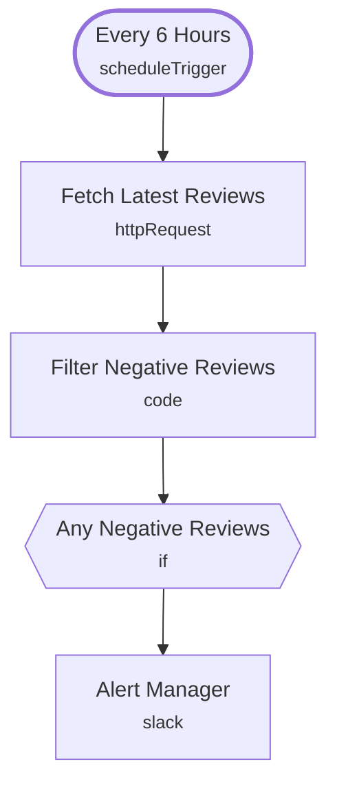

# Negative Review Monitor

<!-- CANVAS:START -->

<!-- CANVAS:END -->

Polls a review feed every 6 hours, isolates the low-rated reviews, and posts each one straight to a Slack channel so a manager can respond before it turns into a bigger problem.

Built for restaurants, cafes and hospitality venues that want a fast heads-up on bad reviews without checking every platform by hand.

## What it does

1. **Every 6 Hours** (Schedule Trigger) polls on a fixed interval.
2. **Fetch Latest Reviews** calls the review source API and returns the most recent reviews.
3. **Filter Negative Reviews** (Code node) keeps only reviews rated 3 stars or lower.
4. **Any Negative Reviews** (IF) checks whether anything survived the filter; if the list is empty the run stops here.
5. **Alert Manager** posts each flagged review — rating, author and text — to a Slack channel.

## Setup (about 10 minutes)

1. **HTTP Request** — set your actual review source endpoint in place of the placeholder `https://YOUR_REVIEW_API/reviews` in **Fetch Latest Reviews**, and add authentication if the API requires it.
2. **Slack** — the OAuth2 credential is already wired on **Alert Manager** (channel "review-alerts"); confirm it points at your workspace and the manager/team channel you actually want alerts in.
3. Adjust the rating cutoff (currently `<= 3`) in **Filter Negative Reviews** if you only want to flag 1 and 2 star reviews.

---

<!-- ARCHITECTURE:START -->
## Architecture

> Shapes: rounded = trigger, hexagon = branch point. Dashed borders mark AI sub-nodes; dotted edges are the model, memory and tool connections feeding an agent. Faded nodes are disabled in this export.
<!-- ARCHITECTURE:END -->
